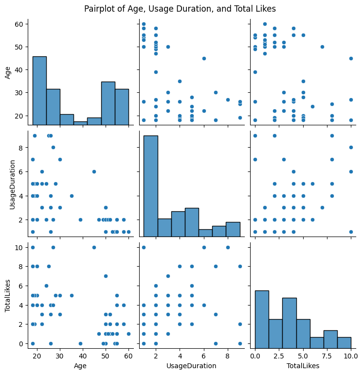

# Social-Media-Users-Engagement-EDA-with-Python
Exploring User Engagement Patterns on Social Media: An Analysis of Country, Age, User Duration, and Likes 
Objective: The objective of this project is to analyze user engagement on social media platforms by examining the relationship between users' countries, age groups, duration of activity, and the number of likes received. The goal is to identify patterns in user duration and likes across different countries and age groups, understand how age and geographical location influence user activity, and derive insights that can help tailor content strategies to maximize user engagement.

This dataset was gotten from kaggle.com

Overview of some Charts:

